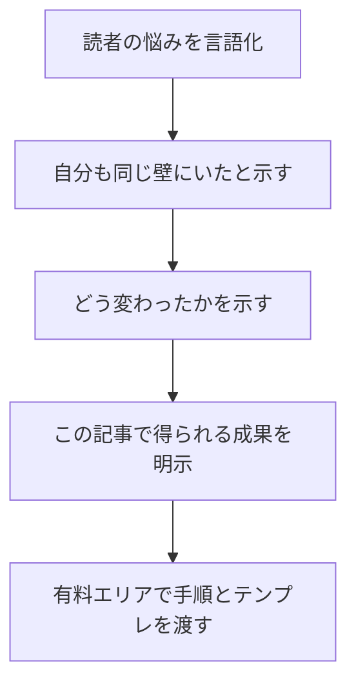
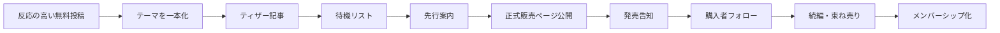

# 有料noteで成功確率を最大化する実践虎の巻

## エグゼクティブサマリー

本レポートは、対象読者が**未指定**であるため、前提を**「幅広い副業志向の個人」**に置いて設計しています。そのうえで、実務上は「本業会社員の副業型」「専門職の知見販売型」「育児・教育など生活課題解決型」「創作・ファンコミュニティ型」のように分けて考えたほうが成果は出やすくなります。noteの直近分析では、成長している領域は「テクノロジー・AI活用」「SNS・コンテンツ運用」「複業・在宅ワーク」「デザイン・動画制作」「育児・教育」で、共通点は**収入アップ・課題解決・再現性**です。 citeturn35view0

「有料noteで**確実に**成功する」という表現は、実務上も法務上も扱いに注意が必要です。noteのクリエイター規約は、**「必ずもうかる」など著しい誤解を招く表現**や、**売上・利益を見せて購入を煽る行為**を禁止しています。また消費者庁は、実際より著しく有利・優良に見せる表示や、事業者表示と分かりにくいステマ表示を規制しています。したがって本レポートは、「成功の保証」ではなく、**成功確率を最大化する再現手順**として読むのが適切です。 citeturn31view3turn9search0turn9search1

勝ち筋はかなり明確です。note株式会社の約30万件分析では、売れている有料記事は、**テーマ選定**では実用ノウハウ系が強く、**価格**では実用ノウハウ系の平均が1,842円、読み物系が983円、**文字数**は売上とほぼ相関がない一方、実用ノウハウ系は**無料エリアで価値をしっかり伝える構成**が効いていました。つまり、売るべきものは「長文」ではなく、**読者が元を取れると感じる具体価値**です。 citeturn35view0

書き方にも明確な傾向があります。note公式分析では、購入されやすいタイトルは**具体性・メリットの明確さ・トレンド性**を備え、購入されやすい無料エリアは**共感・問いかけ／変化の物語／ベネフィット提示**の3要素を含みます。ハッシュタグも、**3〜7個程度**で、**ジャンル・読者ニーズ・具体キーワード**を組み合わせたほうが届きやすいとされています。 citeturn18view0turn20view3turn18view1

商品設計は、ほとんどの個人にとって**単品有料記事から始める**のが最も安全です。note編集部は、メンバーシップは継続価値と導線がある人向きだと繰り返し案内しており、実例でもミヤマさんは「まず単発の有料記事で価値を検証してからメンバーシップへ進むべき」と述べています。反対に、すでに継続発信と集客導線があるなら、**単品 → 有料マガジン → メンバーシップ**の順に階段をつくるとLTVを上げやすくなります。 citeturn20view0turn38view0turn8search6turn32search6

集客は、**note内導線**と**外部導線**の二層で設計すべきです。noteは、タイトル・ハッシュタグ・おすすめ・検索流入が効く構造で、会社側もSEO対策とレコメンド改善を成長要因として挙げています。外部ではXやInstagramで「試食」を出し、深い内容はnoteへ誘導するのが定石です。さらに、事例では「Xフォロワー」よりも**メールリスト**のほうが初速を安定させやすいことが分かります。 citeturn23search3turn34search3turn36view2turn23search0turn23search1

最後に重要なのは、**売れなかったときの再設計手順**を持つことです。販売不振の原因は、多くの場合「テーマが弱い」「無料エリアで価値が伝わらない」「価格がズレている」「導線が弱い」のどれかです。販売後はダッシュボードでアクセス状況と売上管理を見ながら、タイトル・無料エリア・価格・導線を順に調整するのが最短です。 citeturn25search4turn25search8turn18view0turn20view3

## 前提条件と勝ち筋

### 前提条件の整理

まず、この種の有料noteは「作品」よりも「商品」に近い目線で設計したほうが成功しやすいです。noteは2026年1月公表の分析で、年間売上トップ1000クリエイターの平均売上が約1,515万円、有料記事売上が前年同月比26.8%成長、メンバーシップ売上が同81.3%成長と公表しています。また、2024年11月期の年間流通総額は170億円超まで伸びています。市場自体は十分に大きい一方で、売れるのは「その人にしか語れない経験やノウハウ」に価値がある内容です。 citeturn35view0turn34search3

以下の前提は、未指定事項を明示したうえで、このレポート内の推奨戦略を適用する基準です。

| 項目 | 状態 | このレポートでの扱い |
|---|---|---|
| 対象読者層 | 未指定 | 幅広い副業志向の個人を主対象に設定 |
| 既存フォロワー数 | 未指定 | 少数フォロワーでも開始可能だが、導線設計を厳密化 |
| 既存実績 | 未指定 | 実績が薄い場合は「体験の整理」と「限定具体例」で補う |
| ジャンル | 未指定 | 成長カテゴリと evergreen な課題解決テーマを優先 |
| 広告予算 | 未指定 | 原則オーガニック導線前提。必要なら広告は後段で小額検証 |
| 目標収益 | 未指定 | 初回は「反応検証」、次に「月5万〜10万円の再現化」を目標化 |

### 勝ち筋の原則

以下の原則は、note公式の大規模分析、メンバーシップ調査、成功事例の共通項をまとめたものです。 citeturn35view0turn18view0turn20view3turn18view1turn42search0turn36view2

| 原則 | 実務での意味 | 何をするか |
|---|---|---|
| 誰向けかを狭くする | 「みんな向け」は売れにくい | 職種、経験年数、悩み、期限で絞る |
| 解決価値を先に見せる | 文字量より「得られる変化」が重要 | タイトルと無料エリアで成果を約束する |
| 無料で信用、有料で体系化 | いきなり売り込みは弱い | 無料側で問題提起と一部価値提供、有料で手順とテンプレを渡す |
| 単品から始める | 検証コストが最小 | まず1本売って反応の高い切り口を見極める |
| ストック化を意識する | クライアントワーク依存を減らす | 時流ネタと evergreen 記事を混ぜる |
| メールアドレスを持つ | SNS依存リスクを減らす | 待機リスト、ニュースレター、問い合わせ導線を作る |
| 売った後の導線を持つ | 単発で終わるとLTVが低い | 有料マガジン、続編、メンバーシップへつなぐ |

### まず避けるべき失敗

note公式分析や規約から見ると、初期で外しやすいのは次の4つです。タイトルが曖昧、無料エリアで価値が伝わらない、ハッシュタグが抽象的、価格が安すぎて継続不能になることです。加えて、誇大な表現や収益煽りは規約・景表法リスクになります。 citeturn18view0turn20view3turn18view1turn21view2turn31view3turn9search0

| 失敗 | 典型例 | 修正方針 |
|---|---|---|
| タイトルが抽象的 | 「最近思ったこと」「自分なりの考え」 | 対象読者・成果・方法を入れる |
| 無料エリアが弱い | 導入が長い、自分語りだけ | 共感→変化→ベネフィットの順に置く |
| ハッシュタグが雑 | #気づき #学び #ひとりごと | 具体ニーズと検索語に寄せる |
| 価格が低すぎる | 100円で重い実務ノウハウを売る | 相場と負荷を見直して価格を戻す |

## 読者設計と企画設計

### ペルソナ別の戦い方

以下は、**未指定の対象読者を4ペルソナに分けた実務戦略**です。ベースは、noteの成長カテゴリ分析、201人調査、教育・ハンドメイド・デザイン発信者のケースを統合しています。 citeturn35view0turn42search0turn15view0turn15view1turn36view2

| ペルソナ | 悩み | 売りやすい商品 | 推奨価格帯 | 最初の訴求文 |
|---|---|---|---|---|
| 本業会社員の副業志向 | 時間がない、何を売ればいいか不明 | 実務テンプレ、時短術、初収益までの手順 | 980〜1,980円 | 「残業しながらでも再現できる」 |
| 専門職の知見販売 | 自分の知識に値段をつけにくい | 実務解説、ケース集、相談付き上位商品 | 1,480〜4,980円 | 「現場で使える具体策だけ渡す」 |
| 育児・教育・生活課題型 | 同じ悩みの人を助けたい | 配布資料、チェックリスト、実践記録 | 500〜1,500円 | 「明日すぐ使える」 |
| クリエイター・ファン型 | コアファンはいるが深く話せない | 制作裏話、日記、連載、限定音声 | 300〜980円 | 「ここでしか読めない本音」 |

### テーマ選定の基準

noteの直近分析では、有料記事の急上昇カテゴリ上位は**AI活用、SNS・コンテンツ運用、複業・在宅ワーク、デザイン・動画制作、育児・教育**でした。加えて、急成長ハッシュタグには #Threads、#YouTube収益化、#資産形成 が入っています。重要なのは、単に流行語を乗せることではなく、**自分の一次経験**と掛け算できることです。 citeturn35view0

#### テーマ採点表

この採点表は、企画を「売れそう」ではなく「売るに値する」に変えるためのものです。合計75点以上なら販売、60〜74点なら無料記事で反応検証、59点以下なら再企画を推奨します。

| 評価軸 | 配点 | 見るポイント |
|---|---:|---|
| 課題の切実さ | 25 | 放置コストが高い悩みか |
| 再現性 | 20 | 読者が真似できる手順に落とせるか |
| 一次情報性 | 20 | 自分の体験・失敗・数値・実例があるか |
| 検索性 | 15 | タイトルやタグに具体語を入れやすいか |
| 継続展開性 | 10 | 続編、束ね売り、サブスクへ伸ばせるか |
| 更新耐性 | 10 | 1か月で陳腐化しないか |

### 売れるテーマの選び方

| テーマ種別 | 売れやすい例 | 弱い例 | 理由 |
|---|---|---|---|
| 実用ノウハウ | ChatGPT活用、提案書テンプレ、教材配布、撮影方法 | 抽象的な哲学だけ | 読後の成果が明確 |
| 課題解決記録 | 「副業0→初収益」「学級崩壊回避」「在宅ワーク構築」 | 日常日記そのまま | Before/After を示しやすい |
| 業界の裏側 | 現場の失敗談、改善手順、業界特有の落とし穴 | 一般論の寄せ集め | 一次情報の価値が高い |
| ファン・作品型 | 日記、連載、小説、エッセイ、制作過程 | ノウハウ風の弱い読み物 | 支払動機が「体験」だから |

### 目次案と分量の推奨

noteの分析では、**文字数と売上の相関はほぼゼロ**でした。したがって、「長く書く」よりも「何が得られるか」「どこに価値の核心があるか」が優先です。実用ノウハウ系は無料エリアで価値を濃く伝え、読み物系は有料エリアで体験の密度を出すのが定石です。 citeturn35view0

#### 単品有料noteの標準構成

| パート | 推奨文字量の目安 | 役割 |
|---|---:|---|
| タイトル | 28〜45字前後 | 誰向け・成果・切り口を示す |
| 無料エリア導入 | 800〜1,500字 | 課題共有とベネフィット提示 |
| 無料エリア本文 | 800〜2,000字 | 一部価値提供、著者の信頼形成 |
| 有料エリア本編 | 3,000〜8,000字 | 手順、実例、テンプレ、注意点 |
| まとめ・CTA | 300〜800字 | 行動促進、関連商品への導線 |

#### 実務系noteの目次案

以下は「幅広い副業志向の個人」に向けた実務系商品に向く型です。

| 章 | 何を書くか |
|---|---|
| はじめに | このnoteで解決すること、対象読者、対象外 |
| 失敗しやすい前提 | よくある勘違い、やってはいけない初手 |
| 全体像 | 成功までの流れを俯瞰で示す |
| 手順 | ステップごとの具体策 |
| 実例 | 自分のケース、読者ケース、NG例 |
| テンプレ | コピペ可能な文章、表、チェック項目 |
| よくある質問 | 価格、実績不足、集客、炎上不安など |
| 次の一手 | 続編、上位商品、コミュニティへの導線 |

## 執筆と販売ページ設計

### タイトルの設計

note公式の500件分析では、売れているタイトルは**具体性・メリットの明確さ・トレンド性**が共通し、売れにくいタイトルは**曖昧さ・抽象性・メリット不明**が共通していました。したがって、タイトルは「対象読者」「得られる成果」「何をどう教えるのか」を入れるのが基本です。 citeturn18view0

#### 使えるタイトル型

| 型 | 例 |
|---|---|
| 誰向け × 成果 | 副業初心者向け｜初回販売までの有料note設計術 |
| 悩み × 解決策 | noteが売れない人へ｜無料エリアの書き直し方 |
| 数字 × 方法 | 3日で販売ページを完成させるテンプレ集 |
| 経験 × 教訓 | 10本売ってわかった、有料noteの失敗パターン |
| トレンド × 実務 | ChatGPT時代の有料note設計術 |

### 導入と無料エリアの設計

note公式の100件分析では、売れやすい無料エリアには**共感・問いかけ／変化の物語／ベネフィットの提示**が共通していました。実用ノウハウ系では、有料前に「この記事を読むと何ができるようになるか」を明示することが重要です。 citeturn20view3turn19view2

#### 無料エリアの黄金順序



この構成は、読者に「自分ごと化」させ、期待値を上げ、購入判断をしやすくするための標準フローです。note公式の無料エリア分析と、実用ノウハウ系が無料側で価値訴求を強めるという30万件分析の傾向に合致しています。 citeturn20view3turn35view0

#### 導入テンプレ

以下は、無料エリア冒頭のそのまま使える型です。

> 「有料noteを書いたのに売れない」  
> そう感じている人の多くは、内容そのものではなく、**タイトル・無料エリア・価格・導線**のどれかで損をしています。  
> 私も最初は、価値のある内容を書けば自然に売れると思っていました。ですが実際には、販売ページの設計を変えたあとに反応が変わりました。  
> このnoteでは、売れない原因を4つに分けて特定し、今日から直せるチェックリストとテンプレをまとめます。

### 本文の書き方

本文は、**結論 → 理由 → 手順 → 例 → 注意点**の順で書くと再現性が上がります。特に実務系は、抽象論が長いと価値が薄まります。ハンドメイド作家の sarari さんは「簡単にできて効果があったと感じられること」を記事にする方針を語り、教育領域の yukari さんは「明日にでも使える資料」と「見つけやすさ」を重視していました。いずれも、読後すぐ動ける構成です。 citeturn15view1turn15view0

#### 本文の見出し設計

| 見出しの種類 | 役割 | 例 |
|---|---|---|
| 問題提起型 | 読者の痛みを整理 | 売れない原因は内容不足ではない |
| 手順型 | 実務を進めやすくする | まず直すべき3つのポイント |
| 比較型 | 判断材料を増やす | 単品販売とサブスクの違い |
| 事例型 | 信用を補強する | 実際に反応が変わった修正例 |
| 注意喚起型 | 炎上・返金・誤解を防ぐ | ここで煽ると規約違反になる |

### ハッシュタグと回遊導線

note公式の500件分析では、ハッシュタグは**3〜7個程度**、**ジャンル・読者ニーズ・具体キーワード**を組み合わせるのが有効とされています。さらに、記事内に自分の別記事を埋め込み、「この記事を読んだ人にはこちらもおすすめ」と案内すると回遊率が上がります。 citeturn18view1turn21view1

#### タグ設計テンプレ

| 目的 | 推奨タグ例 |
|---|---|
| ジャンル | #副業 #教育 #デザイン #AI活用 |
| 読者属性 | #副業初心者向け #先生向け #会社員向け |
| 具体ニーズ | #販売ページの作り方 #有料記事の書き方 #時短テンプレ |
| トレンド接続 | #ChatGPT活用 #Threads運用 #YouTube収益化 |

### 販売ページの文言

#### 販売ページテンプレ

> **こんな人に向いています**  
> ・有料noteを出したが売れない  
> ・価格設定に自信がない  
> ・SNSで告知しても反応が弱い  
>   
> **このnoteで得られること**  
> ・売れない原因の切り分け方法  
> ・販売ページの修正テンプレ  
> ・価格再設計の基準  
> ・低販売時の打ち手チェックリスト  
>   
> **このnoteの特徴**  
> ・抽象論ではなく、すぐ直せる実務手順に限定  
> ・実例、テンプレ、チェックリストを収録  
> ・単品販売だけでなく、マガジン化・サブスク化も視野に入れた設計  
>   
> **向いていない人**  
> ・作業ゼロで自動的に売れる方法を探している人  
> ・法務や規約を無視して煽り表現を使いたい人  
>   
> **購入前の注意**  
> ・このnoteは成功を保証するものではありません  
> ・実行と改善を前提にした実務ガイドです

### CTAの入れ方

| CTAの位置 | 目的 | 文例 |
|---|---|---|
| 無料エリア末尾 | 購入誘導 | 「ここから先では、実際に売上へつながった修正テンプレを公開します」 |
| 有料本文終盤 | 続編誘導 | 「本編を実装したら、次は有料マガジン化でLTVを上げます」 |
| 記事末尾 | 読者関係維持 | 「感想や改善結果はXまたはお問い合わせから送ってください」 |
| ファン型商品末尾 | 継続課金誘導 | 「日記や裏話を継続して読みたい方はメンバーシップへどうぞ」 |

## 価格設定と収益モデル

### 価格設定の基本線

noteの公式ヘルプでは、記事・マガジン・メンバーシップの価格は、通常会員で**100円〜50,000円**、プレミアム会員やnote proでは**上限100,000円**まで設定可能です。公式ガイドの価格目安は、限定作品の配信が**500円〜**、ビジネスや投資などの情報発信が**1,000円〜**、Zoom相談などを含むものが**3,000円〜**または**5,000円〜**と案内されています。さらに、30万件分析では、売れている実用ノウハウ系の平均価格は**1,842円**、読み物系は**983円**でした。 citeturn8search5turn21view3turn21view2turn35view0

これを踏まえると、個人の初回商品は次のように置くとバランスが良いです。

| 商品タイプ | 推奨初期価格 | こんなときに適合 |
|---|---:|---|
| 実用ノウハウ単品 | 980〜1,980円 | 手順、テンプレ、時短、実務改善 |
| 読み物・体験エッセイ | 300〜980円 | 日記、物語、考察、連載 |
| 配布資料付き単品 | 1,480〜2,980円 | チェックリスト、PDF、スライド付き |
| 相談権付き上位商品 | 4,980〜9,800円 | チャット相談、Zoom、添削 |
| メンバーシップ入門 | 500円前後 | 過去記事、一部限定記事、応援枠 |
| メンバーシップ標準 | 1,500円前後 | 全記事、コメント返信、月1勉強会 |
| メンバーシップ上位 | 5,000円前後 | Q&A、音声、限定会、個別アドバイス |

この価格帯は、note公式の価格レンジ、公式の価格目安、3000件のメンバーシップ分析、30万件の有料記事分析を統合した**実務推奨レンジ**です。あくまで最初の仮置きであり、販売後は反応で調整します。 citeturn8search5turn21view3turn20view1turn35view0

### 安くしすぎない理由

note編集部は「価格を低くしすぎるのはおすすめしない」と明言しています。理由は、作成コストに見合わず、継続モチベーションが下がるからです。特に実務系は、購入者が求めるのは「長文」ではなく「元が取れる成果」なので、必要以上の廉価設定はむしろ価値のシグナルを落とすことがあります。 citeturn21view2turn35view0

### 単品とサブスクの使い分け

| モデル | 使うべき人 | 強み | 弱み | 推奨順序 |
|---|---|---|---|---|
| 単品有料記事 | ほぼ全員 | 検証しやすい、作りやすい | 売るたびに販売設計が必要 | 最初の一手 |
| 有料マガジン | 単品が複数ある人 | 束ね売りで客単価UP | 有料/無料切替不可 | 単品が3本以上たまったら |
| 定期購読マガジン | 定期配信型で premium 利用者 | 月額制で安定 | プレミアム登録と審査が必要 | 一定読者がついてから |
| メンバーシップ | 継続価値とコミュニティがある人 | 継続収益、関係深化 | 運営難度が高い | 最後に拡張 |

有料マガジンは100円から設定でき、通常会員は50,000円、プレミアムは100,000円まで設定可能です。定期購読マガジンは月額販売ですが、**noteプレミアムと審査**が必要です。メンバーシップも審査はあるものの、定期購読マガジンより柔軟に掲示板や複数プランを扱えます。 citeturn8search6turn8search2turn8search3turn32search6turn22view0

### メンバーシップのプラン設計

公式の3000件分析では、売上が高いメンバーシップは**2〜4プラン**、価格差は**約3倍**、お試しの入口として**500円**が多い傾向でした。選択肢が多すぎると意思決定を難しくするため、最初は2〜3段階で十分です。 citeturn20view1

### 決済と手数料

noteヘルプによると、事務手数料は**クレジットカード5% / キャリア15% / PayPay7% / Amazon Pay 7% / noteポイント10% / PayPal 6.5%**、プラットフォーム利用料は**有料記事・有料マガジン・チップ・メンバーシップで10%**、**定期購読マガジンで20%**、振込手数料は**1回270円**です。 citeturn43view0turn31view2

#### 1,000円販売時のネットイメージ

| 決済手段 | 事務手数料 | プラットフォーム利用料 | 受取額の目安 | 備考 |
|---|---:|---:|---:|---|
| クレカ | 50円 | 95円 | 855円 | 振込手数料別 |
| キャリア | 150円 | 85円 | 765円 | 手数料が最も重い |
| PayPay | 70円 | 93円 | 837円 | バランス型 |
| Amazon Pay | 70円 | 93円 | 837円 | バランス型 |
| noteポイント | 100円 | 90円 | 810円 | 有料記事のみ利用可 |
| PayPal | 65円 | 93円 | 842円前後 | 小数点切り捨て考慮 |

この表は、**振込手数料270円を除いた購入単位の受取イメージ**です。1回だけ売れた場合はここに270円が乗るため、販売初期ほど「価格が安すぎる」ことの痛みが大きくなります。 citeturn43view0

### セール戦略

noteには**タイムセール機能**があり、正式に割引販売が可能です。ただし、ヘルプでは**景表法上の注意**があり、本来価格で一定期間販売していることなどの条件が示されています。また、**SNSプロモーション機能**では、Xでの拡散を条件に有料機能を無料または割引にでき、リリース約3か月で利用コンテンツ1万本超、決済数20万件超とされています。 citeturn33search7turn23search4

### 税務とインボイス

税務面では、noteヘルプが明確に、**noteの売上はnoteからの給与や報酬ではなく、クリエイター自身の収益であり、源泉徴収はされず、源泉徴収票も発行しない**と案内しています。したがって、確定申告は自分で処理する前提です。国税庁では、副業に係る所得は一般に**雑所得**に該当しうると説明しており、年末調整済み給与所得者でも、給与以外の所得が**20万円を超える**場合は、原則として確定申告が必要です。事業として営んでいる場合は**事業所得**となる余地もあります。 citeturn29search0turn28search0turn28search3turn28search1

インボイスについては、note規約上、適格請求書発行事業者であるクリエイターに代わって、noteが媒介者交付特例にもとづくインボイス表示機能を提供しています。BtoC中心なら登録の優先度は低めでも、**法人読者や経費処理ニーズ**を狙うなら検討価値があります。 citeturn30view0turn29search3

## 集客導線とローンチ設計

### note内SEOと外部導線の考え方

ここでいう「note内SEO」とは、Googleの一般的なSEOだけでなく、**note内検索・おすすめ・タグ経由・回遊**を含んだ「見つかりやすさ」の設計です。note公式はハッシュタグにより作品が見つかりやすくなると説明しており、会社側のリリースでも**SEO対策の強化とレコメンドエンジン改善**を成長要因に挙げています。さらに、2026年のnote編集部記事では、noteに公開した記事は**検索やおすすめを通じて長く読まれ続けるストック**になりうると説明されています。 citeturn23search3turn34search3turn23search5

つまり、有料noteの集客は「発売日勝負」ではありません。**無料記事で長く拾う流入**と、**ローンチ直後に集中させる外部流入**の両方が必要です。さらに、記事埋め込みでの回遊導線、タグの具体化、関連無料記事から有料記事への橋渡しが効きます。 citeturn21view1turn18view1turn20view3

### チャネル別の役割分担

| チャネル | 主な役割 | 何を出すか | KPIの見方 |
|---|---|---|---|
| note無料記事 | 長期流入・信頼形成 | How/Why の無料公開、一部ノウハウ | PV、スキ、関連記事遷移 |
| note有料記事 | 収益化 | 手順、テンプレ、実例、配布物 | 購入数、CVR、返金率 |
| X | 瞬発拡散 | 一論点だけ切り出した短文 | クリック率、保存、引用反応 |
| Instagram/Threads | 雰囲気訴求 | ビジュアル、ビフォーアフター | プロフ遷移、リンククリック |
| メルマガ/ニュースレター | 初速・再販 | 先行案内、限定特典、発売通知 | 開封率、クリック率、購入率 |
| コラボ | 信頼移転 | 対談、相互紹介、引用 | 紹介経由PV、購入数 |
| 広告 | 追加検証 | 高反応クリエイティブの増幅 | CPA、ROAS |

この役割分担は、note編集部のSNS活用ガイド、ミヤマさんの「Xは試食、noteは本編」という運用、後藤達也さんのTwitter・note・YouTubeの三本柱、そして各クリエイター事例の流入構造から導いた実務型の形です。 citeturn23search0turn23search1turn36view2turn17view0

### 少フォロワーでも始められるか

答えは**Yes**です。note編集部が2026年4月に公開した201人調査では、メンバーシップ開設時に**noteフォロワー1,000人未満が80%**、内訳では**0〜99人が43%**と最多でした。さらに、最初の加入があった時点でも、**メンバー限定記事が5本以下の人が60%**、**0本で加入があった人が14%**いました。大事なのは、完璧に準備してから出すことではなく、**最低限の約束と説明を整えて出し、改善すること**です。 citeturn42search0

### ローンチの推奨フロー



この流れは、ミヤマさんの先行案内、note公式の事前告知推奨、関連無料記事からの誘導、単品からの上位導線づくりを統合したものです。特に、**いきなり全体公開せず、先に熱量の高い人へ見せる**やり方は初速を作りやすいです。 citeturn22view1turn36view2turn21view1

### 発売までのタイムライン

| 時期 | やること | 目標 |
|---|---|---|
| 発売3週間前 | 反応の高いテーマを無料投稿から選ぶ | 「何に金を払うか」を特定 |
| 発売2週間前 | 目次仮案、価格仮置き、ティザー投稿 | 待機リスト取得開始 |
| 発売1週間前 | 下書き完成、第三者レビュー、販売ページ作成 | 伝わりにくい部分を修正 |
| 発売3日前 | ニュースレター・関係者へ先行案内 | 初速を作る |
| 発売日 | 本公開、X・note・メールで同時告知 | まとまったPVを集める |
| 発売翌日〜7日 | FAQ投稿、感想引用、補足無料記事 | CVR改善と取りこぼし回収 |
| 発売2週目 | 価格再検証、関連商品化、束ね売り検討 | LTVを上げる |

メンバーシップを使う場合は、審査は原則即日で終わるものの、**審査通過＝自動公開ではなく、自分で手動公開**が必要です。公開時にはフォロワーへメールやnote上の通知が飛くため、告知準備は先に終えておくべきです。 citeturn22view0turn22view2

### KPIの置き方

標準のダッシュボードでアクセス状況と売上管理は確認できるため、個人でも最低限のKPI追跡は可能です。まずは「売上」だけでなく、**PV → 購入率 → 返金率 → 再購入率**の順で見ます。 citeturn25search4turn25search8turn32search0

#### 目標数値例

以下は**実務的な仮説モデル**です。業界平均ではなく、「初回ローンチの現実的な目安」として使ってください。

| 指標 | 初回の目安 | 良好判定 | 悪化時の見直し順 |
|---|---:|---:|---|
| ティザー記事PV | 500〜2,000 | 1,000超 | タイトル→タグ→SNS告知 |
| 待機リスト登録率 | 3〜10% | 5%以上 | リード文→特典→フォーム位置 |
| 販売ページ到達数 | 100〜500 | 200超 | 導線数→コラボ→再告知 |
| 購入CVR | 1〜5% | 3%以上 | 無料エリア→価格→実績訴求 |
| 返金率 | 0〜3% | 1%未満 | 販売文言→期待値調整 |
| 続編購入率 | 10〜25% | 15%以上 | 関連記事埋め込み→束ね売り |

#### 売上試算例

| 条件 | 数値 |
|---|---:|
| 販売価格 | 1,480円 |
| 販売ページ訪問数 | 400 |
| 購入CVR | 3% |
| 購入数 | 12 |
| 売上総額 | 17,760円 |

さらに、同商品を改善して無料記事や検索から継続流入できるようになると、発売日以外の売上が積み上がります。noteはストック記事が検索やおすすめで長く読まれうるため、**発売後の改訂**も売上策そのものです。 citeturn23search5turn34search3

## 成功事例と失敗事例の比較

まず前提として、公開されている事例の**収益情報の粒度はバラつきます**。そのため、下表では「公開収益」または「公開規模」を併記しています。公開数値があるものはそのまま、価格と会員数から算出できるものは**概算**と明記しました。 citeturn17view0turn17view1turn36view2turn15view0turn15view1turn37search0turn17view3

| 事例 | 形態 | 公開収益または公開規模 | 主流入経路 | 効いた施策 | 失敗・停滞ポイント | 再現可能な学び | 出典 |
|---|---|---|---|---|---|---|---|
| 後藤達也 | メンバーシップ | 約半年で**毎月2万人以上**が購読、月500円。**額面売上は月約1,000万円規模**の概算 | X、note、YouTube | 「経済をわかりやすく」、月15〜20本以上、三本柱運用、長期的信頼重視 | 37万フォロワーでも「100人も集まらない可能性」を想定していた | フォロワー数ではなく**課金導線の信頼設計**が重要 | citeturn17view0turn16view2 |
| 近代麻雀 | 有料マガジン・サブスク | **1年で数千万円** | 既存ブランド、既存Web、著者ファン | 500円×2種＋980円の**三分割商品設計**、note限定書き下ろし | 広告・無料だけでは収益構造に限界があり、収益方法を模索 | **セグメント別商品化**と限定コンテンツが強い | citeturn17view1 |
| ミヤマ | メンバーシップ | **18時間で約200人、4か月で600人**。収益額は非公開 | ニュースレター、X、Threads | **8,500人のメールリスト**へ先行告知、初期枠200の演出、Xは試食でnoteが本編 | 当初は「ニュースレター延長」感覚で始め、行き詰まり | 先行案内、情報の深度別チャネル分割、オンボーディングが効く | citeturn36view2turn38view0 |
| yukari | 有料記事 | 収益額は非公開。Instagram配布企画に**毎回数百人、多い時は1,000人超**の希望者 | Instagram → note | 学年別見出し画像、マガジン分類、時期読みに合わせた投稿 | Instagram配布は工数が大きく、漏れリスクも高かった | **配布の受け皿**としてnoteを使うと事務負荷が下がる | citeturn15view0 |
| sarari | 有料記事・メンバーシップ | 収益額は非公開。購読や**商品購入にも接続** | X → note | 反響の大きかった「スマホ撮影」を商品化、「簡単にできて効果があった」内容だけ選ぶ | 専門性が高すぎる/道具依存のテーマは広く売りにくい | **反響のあった無料投稿を商品化**するのが王道 | citeturn15view1 |
| 宮田飛雄 | 単品有料記事 | 公開1か月超でも**毎日5〜10人購入** | Instagram | 約2か月の修正、英語レベルの異なる3タイプ読者にレビュー、無料ゾーン重視 | 初稿をそのまま売れば伝わらなかった可能性が高い | **第三者レビュー**と無料エリアの磨き込みが強い | citeturn37search0 |
| 永田智 | 定期購読マガジン | 月300円、**3年間毎日更新**。収益額は非公開 | 既存ファン、メディア露出 | 有料にすることで更新責任を作り、深い読者層だけと向き合う | 無料ブログは**2記事くらいで止まっていた** | 有料化は「売上」だけでなく**継続装置**にもなる | citeturn17view3 |

### 事例から見える共通パターン

成功例を横断すると、共通するのは次の4点です。**一つ目は、無料段階で反応のあったテーマを有料化していること。二つ目は、無料と有料の役割が明確なこと。三つ目は、発売前に温度の高い読者へ先に知らせていること。四つ目は、購入後の継続導線があること**です。逆に失敗・停滞例では、「売る前提での設計不足」「更新のしんどさ」「曖昧な価値提示」が目立ちます。 citeturn15view1turn36view2turn17view3turn37search0

| 共通点 | 具体化すると何を意味するか |
|---|---|
| 無料で反応を確認している | いきなり商品を作らず、SNSや無料記事でニーズを見る |
| 有料で体系化している | 無料では断片、有料では手順・型・テンプレまで渡す |
| 温度差で導線を分けている | 一般公開より先に常連へ知らせる |
| 継続商品に伸ばしている | 続編、マガジン、サブスクへ上げる |

## 法務対応と実行テンプレ

### 法的・倫理的留意点

法務面では、最低でも**著作権、引用、広告表示、特商法、税務、返金、インボイス**は押さえるべきです。文化庁とe-Govの原則では、著作権は創作者に帰属し、他人の文章・画像・図表を無断転載することは原則できません。引用は著作権法32条の範囲で認められますが、転載とは別です。note規約でも盗作・剽窃・知的財産権侵害は禁止されています。 citeturn10search1turn11search0turn31view3turn30view0

広告・販売表現では、**「必ず儲かる」**や**過度な煽り**は避けてください。note規約は禁止しており、消費者庁の景表法でも優良誤認・有利誤認の対象になりえます。また、第三者依頼で記事を書く場合、noteヘルプは**主体と便益を明示**し、依頼記事であることが分かるようにするガイドラインを出しています。 citeturn31view3turn9search0turn9search1turn29search5

#### 主要論点の実務表

| 論点 | 必ずやること | やってはいけないこと |
|---|---|---|
| 著作権 | 自作中心、引用は必要最小限・出典明記 | 他人の記事や画像のコピペ転載 |
| 収益訴求 | 実績は事実ベース、条件を明記 | 「誰でも必ず売れる」 |
| 依頼記事・PR | 依頼主と便益を明示 | 広告なのに個人感想に見せる |
| 特商法 | 業として反復継続なら表示確認 | 必要表示を無視する |
| 税務 | 売上・経費を記録し、自分で申告判断 | 「noteが全部やってくれる」と誤解する |
| 返金 | 返金可/不可を販売前に確認 | ダウンロード商品で期待値と条件を曖昧にする |

### 低販売時の対処と代替戦略

売れないときは、いきなり全否定せず、**どこで落ちているか**を見ます。PVが少ないのか、販売ページ到達はあるが買われないのか、買われるが返金されるのかで打ち手は変わります。販売初期の不振は普通で、note編集部の201人調査でも不安の上位は「だれも加入しないのでは」「続けられるか」「告知集客がわからない」でした。 citeturn42search0turn25search4turn25search8turn32search0

#### リスク別の対処表

| 症状 | 典型原因 | 最初の対処 | 次の一手 |
|---|---|---|---|
| PVが少ない | タイトル・タグ・告知不足 | タイトルとタグを修正 | 無料記事を1本追加し、そこから誘導 |
| 販売ページは見られるが売れない | 価格ズレ、無料エリア弱い | 無料エリアを書き直す | 価格を10〜20%調整、特典追加 |
| 返金が出る | 期待値のズレ | 販売ページ文言を修正 | 返金設定と対象読者を見直す |
| 単発で終わる | 再導線がない | 関連記事埋め込み | 有料マガジン化、続編販売 |
| 運営が重い | 約束しすぎ、更新負担 | 頻度を下げて明示 | 500円応援枠＋上位プラン分離 |
| 規約・炎上リスク | 表現・素材・広告表示の甘さ | 一時停止して修正 | 法務チェック表を整備 |

### 実行テンプレ

#### 販売ページテンプレ

```text
タイトル：
【対象読者】が【成果】できる【方法】

冒頭：
このnoteは、【悩み】を持つ人向けの実務ガイドです。
私自身も【過去の状態】でしたが、【変化】を経験しました。
その過程で効果があった手順だけを、テンプレ付きでまとめます。

このnoteで得られること：
・
・
・

向いている人：
・
・

向いていない人：
・
・

目次：
1.
2.
3.
4.

購入前の注意：
・成功を保証するものではありません
・対象読者外だと合わない可能性があります
・法務、税務は必要に応じて専門家へ確認してください

価格：
通常価格【　】円
発売初週価格【　】円
```

#### X投稿テンプレ

```text
【発売予告】
有料noteを出します。

テーマは
「【テーマ】」。

対象は
・【読者像1】
・【読者像2】

入れるもの
・失敗例
・実例
・テンプレ
・チェックリスト

気になる方はこの投稿に反応ください。
先に案内します。
```

```text
【本日発売】
「【タイトル】」を公開しました。

こんな人向けです。
・【悩み1】
・【悩み2】

無料部分で
・なぜ売れないのか
・何を直すべきか
まで読めます。

有料部分では
・手順
・テンプレ
・改善チェック表
をまとめました。
```

```text
【発売翌日の追告知】
昨日公開した note で、特に反応が多かったのは
「【ポイント】」でした。

この note は
・【成果】
・【避けたい失敗】
を短時間で整理したい人向けです。

感想も少しずつ届いています。
必要な人に届くよう、改めて置いておきます。
```

#### メールテンプレ

```text
件名：
【先行案内】新しい有料noteを公開します

本文：
こんにちは、【名前】です。

今回は【テーマ】について、
実際の失敗と改善をまとめた有料noteを公開します。

このnoteで読めること
・【項目1】
・【項目2】
・【項目3】

おすすめの方
・【読者像1】
・【読者像2】

今回は先にこのメールでご案内しています。
一般公開の前に確認したい方は、こちらからどうぞ。

【ひとこと】
今回の内容は、特に【読者の困りごと】に効くはずです。
読んだあと、感想を返してもらえるとうれしいです。
```

#### 週次運用チェックリスト

| 項目 | 実施 | メモ |
|---|---|---|
| 先週のPV・購入数・返金数を確認した | □ |  |
| 売れた導線を特定した | □ |  |
| タイトルを見直す必要があるか判断した | □ |  |
| 無料エリア冒頭を改善した | □ |  |
| 関連記事の埋め込みを更新した | □ |  |
| 外部SNSで再告知した | □ |  |
| 次の単品またはマガジン化候補を決めた | □ |  |
| 読者の質問・感想を記録した | □ |  |
| 規約・表現リスクがないか確認した | □ |  |
| 売れなかった理由を1つに絞って改善した | □ |  |

### 参考リンク集

以下は、実務で優先的に読む価値が高い一次・準一次ソースです。生の数字、規約、運営の推奨、成功事例を先に押さえると、無駄打ちが大きく減ります。

| 区分 | 参考先 |
|---|---|
| note公式データ | note、約30万件の有料記事を分析。はじめたばかりでも収益につながりやすいテーマが明らかに。 citeturn35view0 |
| note公式ガイド | 3000件のメンバーシップを分析してわかった、プラン内容と価格設定のヒント。 citeturn20view1 |
| note公式ガイド | 有料記事500件を分析して見えた、noteで購入されやすいタイトル設計の基本。 citeturn18view0 |
| note公式ガイド | 有料記事100件を分析して見えた、noteで購入されやすい無料エリアの書きかた。 citeturn20view3 |
| note公式ガイド | 有料記事500件を分析して見えた、noteで購入されやすいハッシュタグ設計の基本。 citeturn18view1 |
| note成功事例 | 後藤達也さんに聞く、2万人が直接課金する個人メディアのつくり方。 citeturn17view0 |
| note成功事例 | 近代麻雀が1年間に数千万円の収益をあげた有料記事サブスク販売。 citeturn17view1 |
| note成功事例 | ミヤマさんの18時間で200名を集めたメンバーシップ集客術。 citeturn36view2 |
| 法務 | noteご利用規約、特にクリエイター規約。 citeturn30view0turn31view3 |
| 税務 | 国税庁「雑所得」「事業所得」「給与所得者がネット副収入を得た場合」。 citeturn28search0turn28search1turn28search3 |
| 景表法 | 消費者庁「有利誤認とは」「ステルスマーケティングQ&A」。 citeturn9search0turn9search1 |
| 著作権 | e-Gov 著作権法、文化庁「著作権の基本と海賊版」。 citeturn11search0turn10search1 |
| 関連書籍 | 『ザ・コピーライティング』。 citeturn41search0 |
| 関連書籍 | 『コピーライティング技術大全』。 citeturn41search2 |
| 関連書籍 | 『オウンドメディアで成功するための戦略的コンテンツマーケティング』。 citeturn41search3 |